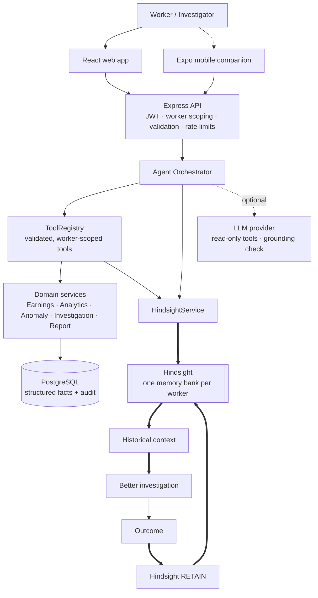

# Architecture

EliteSuraksha 2.0 is the existing EliteSuraksha monorepo (Express + Prisma + PostgreSQL API, React/Vite web, Expo mobile) with a new domain, a new agent layer and Hindsight as persistent memory. No new services were added besides Hindsight itself.

## Layers

| Layer | Code | Notes |
|---|---|---|
| Routes / controllers | `apps/api/src/routes`, `controllers` | `/me/*` (worker) and `/admin/workers/:workerId/*` (admin) share one scoped router (`routes/scoped.routes.js`) |
| Worker scoping | `middlewares/workerContext.js` | sets `req.worker` from the token or an admin-only route param |
| Agent | `services/agent/orchestrator.js` | intent → tools → memory recall → deterministic reasoning → optional LLM → validation → `AgentInteraction` |
| Tools | `services/agent/tools.js` | `ToolRegistry.execute(ctx, name, input)` validates and traces each call |
| Reasoning | `services/agent/reasoning.js` | FACT / INFERENCE / UNKNOWN, recommended actions, timeline, evidence catalogue |
| Analytics | `services/analytics/*` | pure functions: metrics, baselines, comparable sessions, anomaly engine, decomposition |
| Memory | `services/memory/hindsight.service.js` | the only module importing `@vectorize-io/hindsight-client` |
| Ingestion | `services/ingestion.service.js` | PlatformAdapter → records → anomalies → memories; pattern learning |
| Investigations | `services/investigation.service.js`, `report.service.js` | evidence, findings, statuses, outcomes, reports, audit |
| Platform adapters | `apps/api/src/platform` | `GENERIC_DELIVERY`, `GENERIC_RIDE`, `GENERIC_FREELANCE` |
| Demo | `apps/api/src/demo` | deterministic dataset + Judge Demo steps that call the real services |

## Data model (Prisma)

`User`, `OtpRequest` (kept) · `WorkerProfile` (reshaped: city, zone, platform, preferences, demo clock `asOfDate`) · `WorkSession` · `TripRecord` · `EarningsRecord` · `PlatformEvent` · `WorkerBaseline` · `Anomaly` · `Investigation` · `EvidenceItem` · `InvestigationFinding` · `GrievanceReport` · `InvestigationOutcome` · `AgentInteraction` · `MemoryEvent` (audit of every Hindsight operation) · `AuditLog`.

Old → new mapping: claim → investigation, payout → outcome/resolution, trigger event → platform event, risk snapshot → worker baseline, fraud score → anomaly signals, policy → worker preferences/platform context. See [TRANSFORMATION.md](TRANSFORMATION.md).

## Request flow for "Why did my earnings drop?"

1. `POST /api/v1/me/agent/ask` → `requireAuth` → `requireOwnWorker` (worker from token).
2. `detectIntent` → `EARNINGS_DROP`; `extractTarget` resolves the session (explicit date, weekday, or the latest flagged anomaly).
3. Tools: `get_recent_earnings`, `get_comparable_sessions` (baseline + comparables + evaluation), `get_platform_events`, `get_previous_investigations`.
4. `HindsightService.getWorkerMemoryContext`: recall by question + recall of similar cases (tag-filtered), dedupe, relevance filter, ranking.
5. `reasonAboutSession` → facts, inferences, unknowns, actions (memory-derived actions first), timeline.
6. Optional LLM interpretation (read-only tools, JSON schema, grounding check, fallback).
7. `validateAgentAnswer`, persist `AgentInteraction`, return `{answer, trace, toolsUsed, engine}`.

## Demo clock

Synthetic history is dated April–August 2026. `WorkerProfile.asOfDate` tells analytics which day is "today" for that worker, so the time jump is a data operation, not a UI trick. Real workers have no `asOfDate` and use the current date (Asia/Kolkata).
